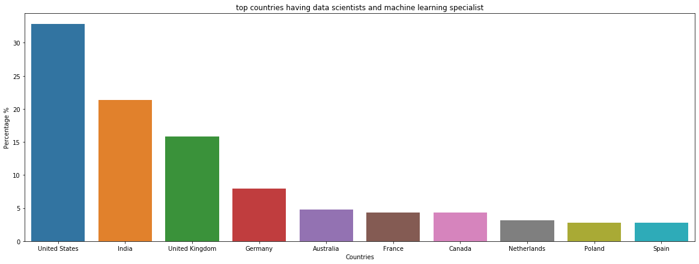
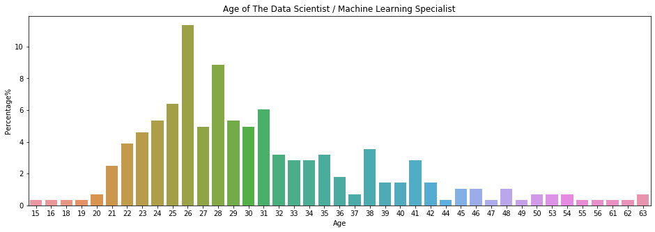
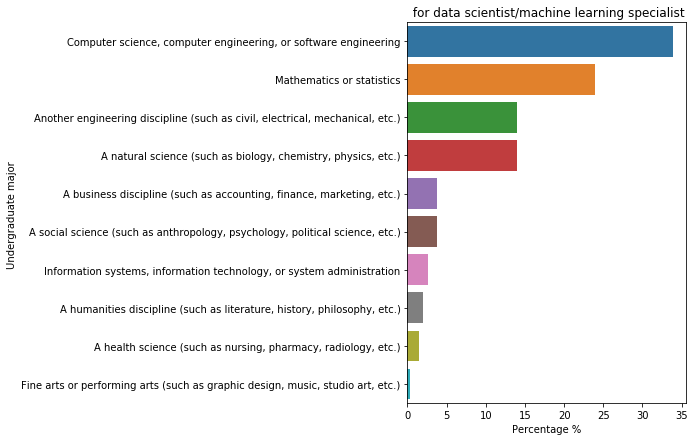
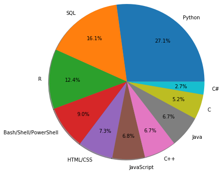
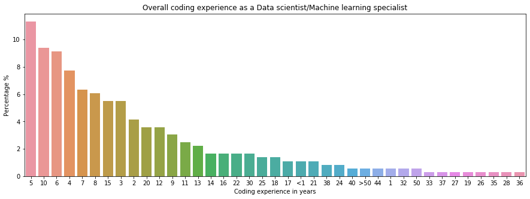
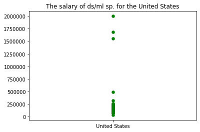

## Stack Overflow 2020 Developer Survey:  The Data Science Industry Analysis for Data Scientist Machine learning specialist

Each year, Stack Overflow publish survey analysis about the developer community about everything from their favorite technologies to their job preferences.

The survey is very useful for the developer community, so I think to increase the benefits by taking a part of the survey which interested with Data Scientists and Machine Learning specialist to analysis it because the statistics can tell us more about our community such as Geographic, Demographic, Industrial and behaviors Analysis. Let's Begin and Have Fun!
To see the data click [here](https://insights.stackoverflow.com/survey/2020)

### Inspiration

**Geographic Analysis:**

    1.Top Countries having Highest Number of DS/ML Specialists.

**Demographic Analysis:**

    2.how many are male,femal,and other as The DS/ML Specialist
    3.what age of people are most of The DS/ML Specialist
    4.what is the Highest Level of Formal Education for the Data Scientist?
    5.what is the Major Field of Study that that ds/ml has?

**The Industrial Analysis:**

    7.Top Languages,Tools & Software For Data Scientists in 2020
    8.Overall how many years of coding experience as a Ds/Ml specialist have?
    9.Does DS/Ml specialist satisfied by their job?
    10.Top Countries with highest salaries of data scientists/ML specialists
    11.Does ds/ml do code as hobby?
    
    

#### Let's Begin with importing required Library


```python
import pandas as pd     #data analysis
import numpy as np

import matplotlib.pyplot as plt     #data visualization
import seaborn as sns
%matplotlib inline

pd.set_option('display.max_columns',None)  # to display all columns in data frame
pd.set_option('display.max_colwidth', None) # to display all content of the output
```


```python
df = pd.read_csv('E:\Projects\stackoverflow\developer_survey_2020\survey_results_public.csv') #read file
df.head(2)
```


<div>
<style scoped>
    .dataframe tbody tr th:only-of-type {
        vertical-align: middle;
    }

    .dataframe tbody tr th {
        vertical-align: top;
    }

    .dataframe thead th {
        text-align: right;
    }
</style>
<table border="1" class="dataframe">
  <thead>
    <tr style="text-align: right;">
      <th></th>
      <th>Respondent</th>
      <th>MainBranch</th>
      <th>Hobbyist</th>
      <th>Age</th>
      <th>Age1stCode</th>
      <th>CompFreq</th>
      <th>CompTotal</th>
      <th>ConvertedComp</th>
      <th>Country</th>
      <th>CurrencyDesc</th>
      <th>CurrencySymbol</th>
      <th>DatabaseDesireNextYear</th>
      <th>DatabaseWorkedWith</th>
      <th>DevType</th>
      <th>EdLevel</th>
      <th>Employment</th>
      <th>Ethnicity</th>
      <th>Gender</th>
      <th>JobFactors</th>
      <th>JobSat</th>
      <th>JobSeek</th>
      <th>LanguageDesireNextYear</th>
      <th>LanguageWorkedWith</th>
      <th>MiscTechDesireNextYear</th>
      <th>MiscTechWorkedWith</th>
      <th>NEWCollabToolsDesireNextYear</th>
      <th>NEWCollabToolsWorkedWith</th>
      <th>NEWDevOps</th>
      <th>NEWDevOpsImpt</th>
      <th>NEWEdImpt</th>
      <th>NEWJobHunt</th>
      <th>NEWJobHuntResearch</th>
      <th>NEWLearn</th>
      <th>NEWOffTopic</th>
      <th>NEWOnboardGood</th>
      <th>NEWOtherComms</th>
      <th>NEWOvertime</th>
      <th>NEWPurchaseResearch</th>
      <th>NEWPurpleLink</th>
      <th>NEWSOSites</th>
      <th>NEWStuck</th>
      <th>OpSys</th>
      <th>OrgSize</th>
      <th>PlatformDesireNextYear</th>
      <th>PlatformWorkedWith</th>
      <th>PurchaseWhat</th>
      <th>Sexuality</th>
      <th>SOAccount</th>
      <th>SOComm</th>
      <th>SOPartFreq</th>
      <th>SOVisitFreq</th>
      <th>SurveyEase</th>
      <th>SurveyLength</th>
      <th>Trans</th>
      <th>UndergradMajor</th>
      <th>WebframeDesireNextYear</th>
      <th>WebframeWorkedWith</th>
      <th>WelcomeChange</th>
      <th>WorkWeekHrs</th>
      <th>YearsCode</th>
      <th>YearsCodePro</th>
    </tr>
  </thead>
  <tbody>
    <tr>
      <th>0</th>
      <td>1</td>
      <td>I am a developer by profession</td>
      <td>Yes</td>
      <td>NaN</td>
      <td>13</td>
      <td>Monthly</td>
      <td>NaN</td>
      <td>NaN</td>
      <td>Germany</td>
      <td>European Euro</td>
      <td>EUR</td>
      <td>Microsoft SQL Server</td>
      <td>Elasticsearch;Microsoft SQL Server;Oracle</td>
      <td>Developer, desktop or enterprise applications;Developer, full-stack</td>
      <td>Master’s degree (M.A., M.S., M.Eng., MBA, etc.)</td>
      <td>Independent contractor, freelancer, or self-employed</td>
      <td>White or of European descent</td>
      <td>Man</td>
      <td>Languages, frameworks, and other technologies I’d be working with;Remote work options;Opportunities for professional development</td>
      <td>Slightly satisfied</td>
      <td>I am not interested in new job opportunities</td>
      <td>C#;HTML/CSS;JavaScript</td>
      <td>C#;HTML/CSS;JavaScript</td>
      <td>.NET Core;Xamarin</td>
      <td>.NET;.NET Core</td>
      <td>Microsoft Teams;Microsoft Azure;Trello</td>
      <td>Confluence;Jira;Slack;Microsoft Azure;Trello</td>
      <td>No</td>
      <td>Somewhat important</td>
      <td>Fairly important</td>
      <td>NaN</td>
      <td>NaN</td>
      <td>Once a year</td>
      <td>Not sure</td>
      <td>NaN</td>
      <td>No</td>
      <td>Often: 1-2 days per week or more</td>
      <td>Start a free trial;Ask developers I know/work with</td>
      <td>Amused</td>
      <td>Stack Overflow (public Q&amp;A for anyone who codes)</td>
      <td>Visit Stack Overflow;Go for a walk or other physical activity;Do other work and come back later</td>
      <td>Windows</td>
      <td>2 to 9 employees</td>
      <td>Android;iOS;Kubernetes;Microsoft Azure;Windows</td>
      <td>Windows</td>
      <td>NaN</td>
      <td>Straight / Heterosexual</td>
      <td>No</td>
      <td>No, not at all</td>
      <td>NaN</td>
      <td>Multiple times per day</td>
      <td>Neither easy nor difficult</td>
      <td>Appropriate in length</td>
      <td>No</td>
      <td>Computer science, computer engineering, or software engineering</td>
      <td>ASP.NET Core</td>
      <td>ASP.NET;ASP.NET Core</td>
      <td>Just as welcome now as I felt last year</td>
      <td>50.0</td>
      <td>36</td>
      <td>27</td>
    </tr>
    <tr>
      <th>1</th>
      <td>2</td>
      <td>I am a developer by profession</td>
      <td>No</td>
      <td>NaN</td>
      <td>19</td>
      <td>NaN</td>
      <td>NaN</td>
      <td>NaN</td>
      <td>United Kingdom</td>
      <td>Pound sterling</td>
      <td>GBP</td>
      <td>NaN</td>
      <td>NaN</td>
      <td>Developer, full-stack;Developer, mobile</td>
      <td>Bachelor’s degree (B.A., B.S., B.Eng., etc.)</td>
      <td>Employed full-time</td>
      <td>NaN</td>
      <td>NaN</td>
      <td>NaN</td>
      <td>Very dissatisfied</td>
      <td>I am not interested in new job opportunities</td>
      <td>Python;Swift</td>
      <td>JavaScript;Swift</td>
      <td>React Native;TensorFlow;Unity 3D</td>
      <td>React Native</td>
      <td>Github;Slack</td>
      <td>Confluence;Jira;Github;Gitlab;Slack</td>
      <td>NaN</td>
      <td>NaN</td>
      <td>Fairly important</td>
      <td>NaN</td>
      <td>NaN</td>
      <td>Once a year</td>
      <td>Not sure</td>
      <td>NaN</td>
      <td>No</td>
      <td>NaN</td>
      <td>NaN</td>
      <td>Amused</td>
      <td>Stack Overflow (public Q&amp;A for anyone who codes);Stack Exchange (public Q&amp;A for a variety of topics);Stack Overflow Jobs (for job seekers)</td>
      <td>Visit Stack Overflow;Go for a walk or other physical activity</td>
      <td>MacOS</td>
      <td>1,000 to 4,999 employees</td>
      <td>iOS;Kubernetes;Linux;MacOS</td>
      <td>iOS</td>
      <td>I have little or no influence</td>
      <td>NaN</td>
      <td>Yes</td>
      <td>Yes, definitely</td>
      <td>Less than once per month or monthly</td>
      <td>Multiple times per day</td>
      <td>NaN</td>
      <td>NaN</td>
      <td>NaN</td>
      <td>Computer science, computer engineering, or software engineering</td>
      <td>NaN</td>
      <td>NaN</td>
      <td>Somewhat more welcome now than last year</td>
      <td>NaN</td>
      <td>7</td>
      <td>4</td>
    </tr>
  </tbody>
</table>
</div>


```python
df.shape #rows and columns 
```


    (64461, 61)


#### Make New Data Frame(ds) for Data science and ML industry 


```python
print(df.DevType.unique())  #here we can find devloper type as data scientist and ml specialist
```

    ['Developer, desktop or enterprise applications;Developer, full-stack'
     'Developer, full-stack;Developer, mobile' nan ...
     'Data scientist or machine learning specialist;Database administrator;Developer, back-end;Developer, front-end;System administrator'
     'Academic researcher;Data or business analyst;Data scientist or machine learning specialist;Database administrator;Designer;Developer, back-end;Developer, desktop or enterprise applications;Developer, embedded applications or devices;Developer, front-end;Developer, full-stack;Developer, game or graphics;Developer, mobile;Developer, QA or test;DevOps specialist;Senior executive/VP;System administrator'
     'Data or business analyst;Developer, mobile;Senior executive/VP;System administrator']
    


```python
ds = df[df['DevType']== 'Data scientist or machine learning specialist'] #made a new dataframe as ds
ds.head(2)
```


<div>
<style scoped>
    .dataframe tbody tr th:only-of-type {
        vertical-align: middle;
    }

    .dataframe tbody tr th {
        vertical-align: top;
    }

    .dataframe thead th {
        text-align: right;
    }
</style>
<table border="1" class="dataframe">
  <thead>
    <tr style="text-align: right;">
      <th></th>
      <th>Respondent</th>
      <th>MainBranch</th>
      <th>Hobbyist</th>
      <th>Age</th>
      <th>Age1stCode</th>
      <th>CompFreq</th>
      <th>CompTotal</th>
      <th>ConvertedComp</th>
      <th>Country</th>
      <th>CurrencyDesc</th>
      <th>CurrencySymbol</th>
      <th>DatabaseDesireNextYear</th>
      <th>DatabaseWorkedWith</th>
      <th>DevType</th>
      <th>EdLevel</th>
      <th>Employment</th>
      <th>Ethnicity</th>
      <th>Gender</th>
      <th>JobFactors</th>
      <th>JobSat</th>
      <th>JobSeek</th>
      <th>LanguageDesireNextYear</th>
      <th>LanguageWorkedWith</th>
      <th>MiscTechDesireNextYear</th>
      <th>MiscTechWorkedWith</th>
      <th>NEWCollabToolsDesireNextYear</th>
      <th>NEWCollabToolsWorkedWith</th>
      <th>NEWDevOps</th>
      <th>NEWDevOpsImpt</th>
      <th>NEWEdImpt</th>
      <th>NEWJobHunt</th>
      <th>NEWJobHuntResearch</th>
      <th>NEWLearn</th>
      <th>NEWOffTopic</th>
      <th>NEWOnboardGood</th>
      <th>NEWOtherComms</th>
      <th>NEWOvertime</th>
      <th>NEWPurchaseResearch</th>
      <th>NEWPurpleLink</th>
      <th>NEWSOSites</th>
      <th>NEWStuck</th>
      <th>OpSys</th>
      <th>OrgSize</th>
      <th>PlatformDesireNextYear</th>
      <th>PlatformWorkedWith</th>
      <th>PurchaseWhat</th>
      <th>Sexuality</th>
      <th>SOAccount</th>
      <th>SOComm</th>
      <th>SOPartFreq</th>
      <th>SOVisitFreq</th>
      <th>SurveyEase</th>
      <th>SurveyLength</th>
      <th>Trans</th>
      <th>UndergradMajor</th>
      <th>WebframeDesireNextYear</th>
      <th>WebframeWorkedWith</th>
      <th>WelcomeChange</th>
      <th>WorkWeekHrs</th>
      <th>YearsCode</th>
      <th>YearsCodePro</th>
    </tr>
  </thead>
  <tbody>
    <tr>
      <th>386</th>
      <td>388</td>
      <td>I am not primarily a developer, but I write code sometimes as part of my work</td>
      <td>Yes</td>
      <td>NaN</td>
      <td>15</td>
      <td>NaN</td>
      <td>NaN</td>
      <td>NaN</td>
      <td>United States</td>
      <td>United States dollar</td>
      <td>USD</td>
      <td>Elasticsearch;PostgreSQL</td>
      <td>MongoDB;MySQL;PostgreSQL</td>
      <td>Data scientist or machine learning specialist</td>
      <td>Other doctoral degree (Ph.D., Ed.D., etc.)</td>
      <td>Employed full-time</td>
      <td>NaN</td>
      <td>NaN</td>
      <td>Industry that I’d be working in;Office environment or company culture</td>
      <td>NaN</td>
      <td>I’m not actively looking, but I am open to new opportunities</td>
      <td>Java;Python;SQL</td>
      <td>Java;Python</td>
      <td>Keras;TensorFlow;Torch/PyTorch</td>
      <td>Apache Spark;Keras;TensorFlow</td>
      <td>NaN</td>
      <td>Confluence;Jira;Github;Slack;Google Suite (Docs, Meet, etc)</td>
      <td>Yes</td>
      <td>Extremely important</td>
      <td>Very important</td>
      <td>NaN</td>
      <td>NaN</td>
      <td>Once a year</td>
      <td>No</td>
      <td>NaN</td>
      <td>No</td>
      <td>NaN</td>
      <td>NaN</td>
      <td>Hello, old friend</td>
      <td>Stack Overflow (public Q&amp;A for anyone who codes);Stack Exchange (public Q&amp;A for a variety of topics)</td>
      <td>Go for a walk or other physical activity</td>
      <td>Linux-based</td>
      <td>10,000 or more employees</td>
      <td>Android;AWS;Docker;Linux;MacOS</td>
      <td>Android;AWS;Linux;MacOS</td>
      <td>I have little or no influence</td>
      <td>NaN</td>
      <td>Yes</td>
      <td>Yes, definitely</td>
      <td>Less than once per month or monthly</td>
      <td>A few times per week</td>
      <td>Easy</td>
      <td>Appropriate in length</td>
      <td>NaN</td>
      <td>Another engineering discipline (such as civil, electrical, mechanical, etc.)</td>
      <td>Flask</td>
      <td>Flask</td>
      <td>Somewhat less welcome now than last year</td>
      <td>40.0</td>
      <td>12</td>
      <td>5</td>
    </tr>
    <tr>
      <th>506</th>
      <td>508</td>
      <td>I am not primarily a developer, but I write code sometimes as part of my work</td>
      <td>Yes</td>
      <td>NaN</td>
      <td>13</td>
      <td>Yearly</td>
      <td>250000.0</td>
      <td>250000.0</td>
      <td>United States</td>
      <td>United States dollar</td>
      <td>USD</td>
      <td>MongoDB;PostgreSQL</td>
      <td>MongoDB</td>
      <td>Data scientist or machine learning specialist</td>
      <td>Other doctoral degree (Ph.D., Ed.D., etc.)</td>
      <td>Employed full-time</td>
      <td>NaN</td>
      <td>NaN</td>
      <td>Remote work options;How widely used or impactful my work output would be;Opportunities for professional development</td>
      <td>Very satisfied</td>
      <td>I am not interested in new job opportunities</td>
      <td>Python</td>
      <td>Python</td>
      <td>Apache Spark;Hadoop;Pandas;TensorFlow;Torch/PyTorch</td>
      <td>Pandas</td>
      <td>Github</td>
      <td>Confluence;Jira;Github;Slack;Google Suite (Docs, Meet, etc)</td>
      <td>Yes</td>
      <td>Extremely important</td>
      <td>Critically important</td>
      <td>Better compensation;Better work/life balance;Growth or leadership opportunities</td>
      <td>Read company media, such as employee blogs or company culture videos;Company reviews from third party sites (e.g. Glassdoor, Blind);Personal network - friends or family;Read other media like news articles, founder profiles, etc. about the company</td>
      <td>Once every few years</td>
      <td>No</td>
      <td>Yes</td>
      <td>Yes</td>
      <td>Occasionally: 1-2 days per quarter but less than monthly</td>
      <td>NaN</td>
      <td>Indifferent</td>
      <td>Stack Overflow (public Q&amp;A for anyone who codes);Stack Exchange (public Q&amp;A for a variety of topics)</td>
      <td>Call a coworker or friend;Go for a walk or other physical activity</td>
      <td>MacOS</td>
      <td>100 to 499 employees</td>
      <td>Linux</td>
      <td>Linux</td>
      <td>I have little or no influence</td>
      <td>Straight / Heterosexual</td>
      <td>Yes</td>
      <td>Yes, definitely</td>
      <td>Multiple times per day</td>
      <td>Multiple times per day</td>
      <td>Easy</td>
      <td>Too long</td>
      <td>No</td>
      <td>Mathematics or statistics</td>
      <td>NaN</td>
      <td>NaN</td>
      <td>A lot less welcome now than last year</td>
      <td>45.0</td>
      <td>37</td>
      <td>30</td>
    </tr>
  </tbody>
</table>
</div>


```python
print("the data science dataframe shape %s and the stackoverflow dataframe shape %s "%(ds.shape, df.shape))
```

    the data science dataframe shape (369, 61) and the stackoverflow dataframe shape (64461, 61) 
    

## Geographic Analysis for Data Scientist / Machine Learning Specialist


### 1.Top Countries having Highest Number of Respondents who are Data Scientist / Machine Learning Specialists


```python
country = ds.Country.value_counts().head(10)  # chosing top 10 

x = country.index               #coping column names
y = country/country.sum() *100  #calculating percentage 

f,ax1 = plt.subplots(figsize=(20,7)) #plotting graph
sns.barplot(x=x, y=y, ax=ax1);
ax1.set(xlabel = 'Countries', ylabel = 'Percentage %', title = "top countries having data scientists and machine learning specialist");

```





## Demographic Analysis for Data Scientist / Machine Learning Specialist


### 1. Gender of The Data Scientist / Machine Learning Specialist


```python
pd.DataFrame(ds['Gender'].dropna().str.split(';').to_list()).stack().value_counts()
```


    Man                                                  255
    Woman                                                 53
    Non-binary, genderqueer, or gender non-conforming      4
    dtype: int64


```python
gender = pd.DataFrame(ds['Gender'].dropna().str.split(';').to_list()).stack() #casted and saved in gender
gender = gender.value_counts()

labels = gender.index #there are four types but for convenience we clubed non binary and transgender into one

#labels = 'Male', 'Female', 'Non-binary or Transgender'
sizes = gender/gender.sum() *100
#sizes = [85.6, 12.9, 1.5]     #calculated separately

pie,ax1 =plt.subplots(figsize = (10,5))

plt.pie(gender,labels=labels,autopct='%.1f%%',pctdistance=0.75,explode=[0.07]*3,startangle=27,radius=1.5);
```


### 2. Age of The Data Scientist / Machine Learning Specialist


```python
age = pd.DataFrame(ds['Age'].dropna().astype(int).to_list()).stack()
age = age.value_counts()

x = age.index
y = age/age.sum() *100

f,ax1 = plt.subplots(figsize = (16,5))
ax1.set(xlabel = 'Age', ylabel = 'Percentage%', title = 'Age of The Data Scientist / Machine Learning Specialist')
sns.barplot(x=x, y=y, ax=ax1)
plt.show()
```





### 3. The Highest Level of Formal Education for the Data Scientists


```python
formal_ed = pd.DataFrame(ds['EdLevel'].dropna().str.strip().tolist()).stack() #and here we use strip()
formal_ed = formal_ed.value_counts()

f,ax1 = plt.subplots(figsize = (5,10))
x = formal_ed/formal_ed.sum() *100
y = formal_ed.index

ax1.set(xlabel = 'Percentage %', ylabel = 'Formal Education', 
        title = "Highest level of education for data scientist/machine learning specialist")
sns.barplot(x=x, y=y, ax=ax1);
```


### 4. The Major Field of Study that the Data Scientists graduated from it


```python
major_ed = pd.DataFrame(ds['UndergradMajor'].dropna().str.strip().tolist()).stack()
major_ed = major_ed.value_counts()

f,ax1 = plt.subplots(figsize = (5,7))

x = (major_ed/major_ed.sum() * 100)
y = major_ed.index


ax1.set(ylabel = "Undergraduate major ", xlabel = "Percentage %", title = " for data scientist/machine learning specialist")

sns.barplot(x=x, y=y, ax=ax1)

plt.show()
```





## The Industrial Analysis


### 1. Top Languages,Tools & Software  Data Scientists used in 2020


```python
lang = pd.DataFrame(ds['LanguageWorkedWith'].dropna().str.split(';').tolist()).stack().value_counts().head(10)

portion = lang/lang.sum() *100
plt.pie(x = portion, data = lang, labels = lang.index, autopct = '%.1f%%', pctdistance=0.7, shadow=True, radius=1.8);
```





###  2. Overall coding experience as a Data scientist/Machine learning specialist


```python
ds['YearsCode'].value_counts() #notice that there are two different entries compare to others
```


    5                     41
    10                    34
    6                     33
    4                     28
    7                     23
    8                     22
    15                    20
    3                     20
    2                     15
    12                    13
    20                    13
    9                     11
    11                     9
    13                     8
    16                     6
    22                     6
    14                     6
    30                     6
    18                     5
    25                     5
    Less than 1 year       4
    21                     4
    17                     4
    38                     3
    24                     3
    32                     2
    44                     2
    1                      2
    40                     2
    50                     2
    More than 50 years     2
    37                     1
    19                     1
    35                     1
    27                     1
    33                     1
    26                     1
    36                     1
    28                     1
    Name: YearsCode, dtype: int64


```python
# Replace those entries with other notation so that graph looks clean(values will not overlap).
yrs_code = ds['YearsCode'].replace({'Less than 1 year': '<1','More than 50 years':'>50'}).value_counts()


x = yrs_code.index
y = (yrs_code/sum(yrs_code) *100)

#plotting graph
f,ax1 = plt.subplots(figsize=(15,5))
sns.barplot(x=x, y=y, ax=ax1)
ax1.set(xlabel = 'Coding experience in years', ylabel = 'Percentage %', 
        title = "Overall coding experience as a Data scientist/Machine learning specialist");

```





### 3. Job satisfaction as a Data scientist/Machine learning specialist


```python
j_sat = ds['JobSat'].dropna().value_counts()

plt.pie(x=j_sat, labels = j_sat.index, autopct = '%.1f%%', shadow = True, data = j_sat, radius = 1.8);
```


### 4. Countries with highest salaries of data scientists/ML specialists


```python
sal_cont = ds[['ConvertedComp','Country']].dropna().groupby(by='Country').sum().sort_values(by='ConvertedComp',ascending=False).head(10)

new = sal_cont.reset_index()
x = new['Country']
y = new['ConvertedComp']/100

#plotting graph
f,ax1 = plt.subplots(figsize=(15,5))
sns.barplot(x=x, y=y, ax=ax1)
ax1.set(xlabel = 'Country', ylabel = 'Avg Salary per year in $', 
        title = "Top 10 countries with highesst salaries of data scientists/Ml specialists");
```


```python
# Just Look at the braod spetrum of perticular the unites state's salaries.

us_grp = ds[['ConvertedComp','Country']].dropna().groupby(by='Country')
#we extracted the'US' group by using get_group method and sorted the values by descending.
us = pd.DataFrame(us_grp.get_group('United States')).sort_values(ascending=False,by='ConvertedComp')
us = us[us.ConvertedComp !=0] #we ignored the salaries which are enterd 0
us.head()
```


<div>
<style scoped>
    .dataframe tbody tr th:only-of-type {
        vertical-align: middle;
    }

    .dataframe tbody tr th {
        vertical-align: top;
    }

    .dataframe thead th {
        text-align: right;
    }
</style>
<table border="1" class="dataframe">
  <thead>
    <tr style="text-align: right;">
      <th></th>
      <th>ConvertedComp</th>
      <th>Country</th>
    </tr>
  </thead>
  <tbody>
    <tr>
      <th>18126</th>
      <td>2000000.0</td>
      <td>United States</td>
    </tr>
    <tr>
      <th>33158</th>
      <td>1680000.0</td>
      <td>United States</td>
    </tr>
    <tr>
      <th>61373</th>
      <td>1560000.0</td>
      <td>United States</td>
    </tr>
    <tr>
      <th>20242</th>
      <td>490000.0</td>
      <td>United States</td>
    </tr>
    <tr>
      <th>43729</th>
      <td>325000.0</td>
      <td>United States</td>
    </tr>
  </tbody>
</table>
</div>


```python
plt.scatter(data=us,x='Country',y='ConvertedComp',s=30,c='Green'); #plotted the graph of us
plt.title("The salary of ds/ml sp. for the United States");
```





###  5. Coding as a hobby

**Data scientist/ml specialist who code as hobby**


```python
hobby = ds['Hobbyist'].dropna().value_counts()

plt.pie(x=hobby, labels = hobby.index, autopct = '%.1f%%', shadow = True, data = hobby, radius = 1.8);
```


## Modeling


```python
#Choose on which data you wants to buid your model
num_vars = ds[['Respondent','YearsCode','ConvertedComp','JobSat','EdLevel','LanguageWorkedWith','Gender']]
```

### Missing data


```python
# Check for presence of null data

vars_with_na = [var for var in num_vars.columns if num_vars[var].isnull().sum()>0]

for var in vars_with_na:
    print(var, np.round(num_vars[var].isnull().mean(), 3),' % Missing value')
```

    YearsCode 0.019  % Missing value
    ConvertedComp 0.382  % Missing value
    JobSat 0.136  % Missing value
    EdLevel 0.014  % Missing value
    LanguageWorkedWith 0.076  % Missing value
    Gender 0.16  % Missing value
    

### Categorical Variables


```python
# leaving the respondent column all other columns contains null data
# Treating null data by type wise let's check first with categorical column

cat_df = num_vars.select_dtypes(include = 'O').copy()  #Identify categorical columns
cat_df.head()
```


<div>
<style scoped>
    .dataframe tbody tr th:only-of-type {
        vertical-align: middle;
    }

    .dataframe tbody tr th {
        vertical-align: top;
    }

    .dataframe thead th {
        text-align: right;
    }
</style>
<table border="1" class="dataframe">
  <thead>
    <tr style="text-align: right;">
      <th></th>
      <th>YearsCode</th>
      <th>JobSat</th>
      <th>EdLevel</th>
      <th>LanguageWorkedWith</th>
      <th>Gender</th>
    </tr>
  </thead>
  <tbody>
    <tr>
      <th>386</th>
      <td>12</td>
      <td>NaN</td>
      <td>Other doctoral degree (Ph.D., Ed.D., etc.)</td>
      <td>Java;Python</td>
      <td>NaN</td>
    </tr>
    <tr>
      <th>506</th>
      <td>37</td>
      <td>Very satisfied</td>
      <td>Other doctoral degree (Ph.D., Ed.D., etc.)</td>
      <td>Python</td>
      <td>NaN</td>
    </tr>
    <tr>
      <th>516</th>
      <td>1</td>
      <td>Very satisfied</td>
      <td>Master’s degree (M.A., M.S., M.Eng., MBA, etc.)</td>
      <td>Python</td>
      <td>Man</td>
    </tr>
    <tr>
      <th>690</th>
      <td>30</td>
      <td>Slightly dissatisfied</td>
      <td>Master’s degree (M.A., M.S., M.Eng., MBA, etc.)</td>
      <td>Java;JavaScript;Python;SQL</td>
      <td>Man</td>
    </tr>
    <tr>
      <th>711</th>
      <td>8</td>
      <td>Very satisfied</td>
      <td>Master’s degree (M.A., M.S., M.Eng., MBA, etc.)</td>
      <td>Bash/Shell/PowerShell;HTML/CSS;JavaScript;Python;R;SQL</td>
      <td>Man</td>
    </tr>
  </tbody>
</table>
</div>


### Handeling categorical varialbles


```python
# Replace NA with Mode of a column in categorical variables, that's one way to do it.

for col in cat_df.columns:
    #calculating and storing the each mode value of the column
    mode_val = cat_df[col].mode()[0]
    #Filling the mode value at null values
    cat_df[col].fillna(mode_val, inplace = True)

cat_df.head()
```


<div>
<style scoped>
    .dataframe tbody tr th:only-of-type {
        vertical-align: middle;
    }

    .dataframe tbody tr th {
        vertical-align: top;
    }

    .dataframe thead th {
        text-align: right;
    }
</style>
<table border="1" class="dataframe">
  <thead>
    <tr style="text-align: right;">
      <th></th>
      <th>YearsCode</th>
      <th>JobSat</th>
      <th>EdLevel</th>
      <th>LanguageWorkedWith</th>
      <th>Gender</th>
    </tr>
  </thead>
  <tbody>
    <tr>
      <th>386</th>
      <td>12</td>
      <td>Very satisfied</td>
      <td>Other doctoral degree (Ph.D., Ed.D., etc.)</td>
      <td>Java;Python</td>
      <td>Man</td>
    </tr>
    <tr>
      <th>506</th>
      <td>37</td>
      <td>Very satisfied</td>
      <td>Other doctoral degree (Ph.D., Ed.D., etc.)</td>
      <td>Python</td>
      <td>Man</td>
    </tr>
    <tr>
      <th>516</th>
      <td>1</td>
      <td>Very satisfied</td>
      <td>Master’s degree (M.A., M.S., M.Eng., MBA, etc.)</td>
      <td>Python</td>
      <td>Man</td>
    </tr>
    <tr>
      <th>690</th>
      <td>30</td>
      <td>Slightly dissatisfied</td>
      <td>Master’s degree (M.A., M.S., M.Eng., MBA, etc.)</td>
      <td>Java;JavaScript;Python;SQL</td>
      <td>Man</td>
    </tr>
    <tr>
      <th>711</th>
      <td>8</td>
      <td>Very satisfied</td>
      <td>Master’s degree (M.A., M.S., M.Eng., MBA, etc.)</td>
      <td>Bash/Shell/PowerShell;HTML/CSS;JavaScript;Python;R;SQL</td>
      <td>Man</td>
    </tr>
  </tbody>
</table>
</div>


**Converting categorical variable into dummy/indicator variables.**


```python
cat_cols_list = cat_df.columns
def create_dummy_df(cat_df,cat_cols):
    
    for col in cat_cols:
        try:
            # remove all the original columns in cat_df
            # dummy columns for each of the categorical columns in cat_df
            cat_df = pd.concat([cat_df.drop(col, axis=1),pd.get_dummies(data = cat_df[col], prefix=[col], 
                                                                        prefix_sep='_', 
                                                                        drop_first=True,dummy_na=False)],axis=1)
        except:
            continue
    return cat_df
    
df_new = create_dummy_df(cat_df,cat_cols_list)
```


```python
df_new.shape  #shape of all categorical columns
```


    (369, 229)


### Numerical variables


```python
quant_var = num_vars.select_dtypes(exclude = 'O')
quant_var.isnull().sum() #null values. as Respondent column act an index it does not have any missing values.
```


    Respondent         0
    ConvertedComp    141
    dtype: int64


```python
# Replace NA with mean

fill_mean = lambda col: col.fillna(col.mean()) #created a lambda function to fill avg values to columns

var_mean = num_vars[['Respondent','ConvertedComp']].apply(fill_mean) #note will only applies to salary
var_mean.shape #shape of numrical columns
```


    (369, 2)


```python
#Putting all to gether

df_final = pd.concat([var_mean,df_new],axis=1)
df_final.shape # shape of categorical + numerical columns
```


    (369, 231)


### Modeling


```python
from sklearn.linear_model import LinearRegression
from sklearn.model_selection import train_test_split
from sklearn.metrics import r2_score, mean_squared_error

"""  
    To build a clean_fit model we should start by doing:
    
        1. Make in input variables "X" and output variable "y"
        2. Split you data into training set and test set
        3. Instantiate our model
        4. Fit the model
        5. Predict our model and score
"""

def clean_fit_model(df_final):
    
    #make X and y as input and out variables
    X = df_final.drop(columns=['ConvertedComp'])  #only drop salary column 
    y = df_final['ConvertedComp']                 #out variable which we have to predict
    
    #Split into train and test
    X_train, X_test, y_train, y_test = train_test_split(X, y, test_size=.3, random_state=42)
    
    #Instaantiate 
    lm_model = LinearRegression(normalize=True)
    
    #Fitting model
    lm_model.fit(X_train,y_train)
    
    #Predict using your model
    y_test_preds = lm_model.predict(X_test)
    y_train_preds = lm_model.predict(X_train)
    
    #Score using your model
    test_score = r2_score(y_test,y_test_preds)
    train_score = r2_score(y_train,y_train_preds)
    
    return test_score, train_score,X_train, X_test, y_train, y_test,y_test_preds,y_train_preds


test_score,train_score, X_train, X_test, y_train, y_test,y_test_preds,y_train_preds = clean_fit_model(df_final)
```


```python
print("the rsquared on training data is {}. \n & the rsquared on the test data is {}.".format(train_score,test_score))
```

    the rsquared on training data is 0.6000640959457194. 
     & the rsquared on the test data is -4.7787615892376845e+29.
    

As you can see our model perform well on the training data but on the test data it perform worst. So this is clearly an example of "Overfitting" and we should do some more work to tackle this situation.
